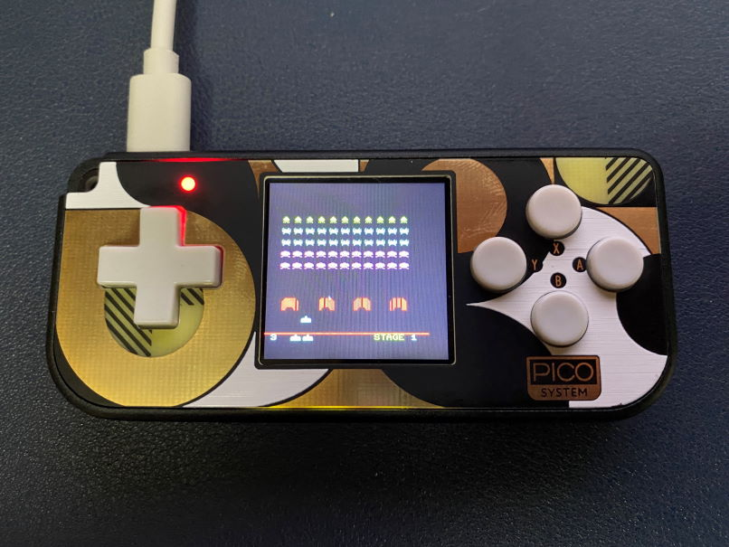

# Space Invader for Pimoroni's PicoSystem

Based on [Daft-Freak's](https://github.com/Daft-Freak/picopacman/tree/picosystem) execellent work
Fork of [KenKenMkIISR](https://github.com/KenKenMkIISR/picoinvader) to make it work on [Pimoroni's PicoSystem](https://shop.pimoroni.com/products/picosystem)


Download the compiled UF2 from the releases' section

Building

Please ensure you have the pre-requisites installed and have raspberry pi's official pico SDK in path

```
sudo apt install cmake gcc-arm-none-eabi libnewlib-arm-none-eabi libstdc++-arm-none-eabi-newlib
git clone https://github.com/raspberrypi/pico-sdk.git ~/pico-sdk
echo 'export PICO_SDK_PATH="~/pico-sdk"' >> ~/.bashrc
source ~/.bashrc
```

Then clone this repo and go into it's path:

```
git clone git@github.com:prashantkamdar/picoinvader.git
cd picoinvader
```

Then finally to build it:

``` 
cmake -DPICO_BOARD=pimoroni_picosystem
make
```

Copy the generated UF2 to your PicoSystem




## Original README:

ラズベリーPi PicoにQVGAの液晶を接続して動作するインベーダーゲームです。  
小型スピーカーを接続して音声も鳴らせます。  
とてもシンプルな回路なので、簡単に製作することができます。  
液晶は240x320ドット、コントローラにILI9341を搭載したSPI接続のものに対応しています。  
他のパックマン、テトリスなどと違い液晶のメモリから読出しを行うため、MISO端子の接続も必要ですのでご注意ください。  
  
### 実行方法
ラズベリーPi PicoのBOOTSELボタンを押しながらPCのUSBポートに接続し、バイナリーファイル invaderpico.uf2 をラズベリーPi Picoにコピーしてください。  
  
### ソースプログラムのビルド方法
ソースプログラムのビルドにはRP2040に対応したコンパイラの他、CMake、pico-sdkが必要です。  
SDKが使用できる環境設定をした上で、ダウンロードした拡張子が.c .h .txt .cmakeのファイルを同じフォルダに入れてビルドしてください。  
  
